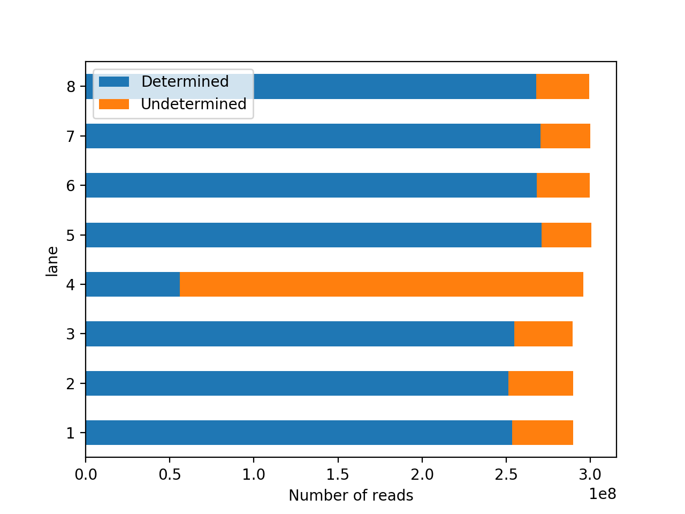

# Summary

The field of genomics has reached a mature stage where complete human sequencing
can be performed routinely, hundred of bacterial strains can be studied
comparitively, etc. The recent pendemic of the SARS-covid virus has shown
highlighted the power of sequencing. In a few months, thousands of genomes have
been sequenced and evolution of the virus could be studied as it spred the
world. This is achievable thanks to major advances in sequencing technologies in
the last few decades but also the emergence of bioinformatics tools and
pipelines that are more and more accessible and open to the scientific
community. Sequencing technologies currently span short and long-read technologies. The first one is mostly based on the Illumina Sequencers while the second are based on Pacbio and Nanopore technologies. Irrespective of the technology used, the data useful for subsequent analysis is in the form of FastQ files. Surprinsingly, those files are text-files storing the sequences that have been generated together with their quality at each position. The simplicity of such format led to a plethora or more or less complex analysis tools used in the field of bioinformatics.

The short-read technology is currently led by Illumina; amongst the sequencers a few of them (e.g. NextSeq) do not provide the FastQ automatically. Instead, raw data are provided. Before undergoing any analysis, a so-called base-calling is required. This is achieve by a tool provided by Illumina, which is called blc2fastq [@bcl2fastq], wwhich will be discussed hereafter.  Once this tool has generated the FastQ (automatically or not), the first check performed by eihter experimentalist or analysists is to check the quality of the data. 

Most research and / or production facilities that are involved in Sequencing
then perform qulaity check of the different samples using FastQC [@Andrews2010].  
This tools provide useful insights. The main goal being to check that the overall quality of the reads 
is as expected. 

Most production facilities already have their own pipeline with FastQC or
home-made fastqc tools. Yet, most researchers discovering genomics (students,
postdoc, etc) would face common issues: where to find the tools, how to
demultiplex the data (if needed), how to get simple plot that summarizes the
fastqc results of tens or hundreds of samples, what are the main sanity checks
to perform, how to run the tools on a cluster, etc

Here we the sequana\_fastqc Snakemake pipeline that is available within the Sequana framework [@Cokelaer2017]. They are used in production within a sequencing platform and can be used by non-expert users. We also provide a tool that wraps the bcl2fastq tool providing the same API to run locally or on a cluster. 

# Statement of need

sequana\_demultiplex and sequana\_fastqc enables simple base-calling of raw
Illumin data and quality assessment of any type of FastQ sequencing data sets,
either locally or on clusters. 


The pipelines are designed to be used by any persons involved in Sequencing
platform. It is used in productionby engineers, lab personnel, researchers. The
main interest is that it provide fastqc for each samples, summarizing the
results with MultiQC plugins, and provide a single HTML entry point. 


# Installation, usage, reproducibilty

One of the key feature of the two pipelines presented here abobe is to allow an
easy an quick deployment of the tools, especially after bug fixes or new
features implementation. 

The first step consists in installation the Sequana library. This can be achieve
in two ways. First, since Sequana is a Python library, one can simply install it
using the standard procedure. All releases are available on pypi.org, therefore
the main library can be installed using 

```shell
   pip install sequana
```

Second, since sequana is available on Bioconda [@Gruning2018]


    sequana_fastqc
    cd fastqc
    sh fastqc.sh


Example on a cluster


**Sequana** is an open source project (https://github.com/sequana/sequana). It is developed with the aim
of simplifying the development of new tools (for developers) and the deployment of the pipelines (for users).
The extended documentation (http://sequana.readthedocs.org) and test suite (on [Travis.org](http://travis-ci.org)) provide a high-quality
software that is routinely tested. **Sequana** is now available on bioconda making the installation easier and faster by taking care of the dependencies (e.g., samtools, bwa, or Python libraries).

Finally, for end-users, we also developed a Graphical interface called **Sequanix** [@sequanix:2017] developed with the PyQt framework (see left panel of the image here below). **Sequanix** standalone exposes all **Sequana** pipelines (Snakemake pipelines) within an easy-to-use interface. Within the graphical interface, the configuration file used by Snakemake are automatically loaded and can be edited by end-users with dedicated widgets. We made the interface generic enough that not only Sequana pipelines can be run interactively but also any Snakemake pipelines.





reproducibility: sequana is on bioconda, the pipelines are on pypi with
release version. The third-party tools are on bioconda (fastqc) and within a
singularity (fastqc and bcl2fastq).

# Acknowledgments

We acknowledge contributions from ....


# References


